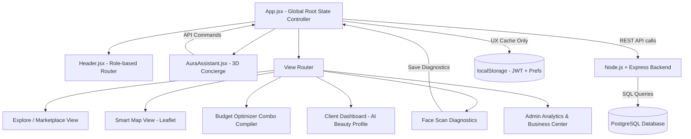

# System Architecture – Aura Beauty OS

This document details the high-level architecture, module decomposition, data persistence schemas, and graphics pipelines driving **Aura Beauty OS**.

---

## 🗺️ Component Diagram & Module Layout

The application separates core layers to ensure high modularity, high performance, and visual isolation:



---

## 💾 Data Persistence Schema (PostgreSQL)

Aura uses a **hybrid storage model**: PostgreSQL (via the Node.js + Express backend) is the single source of truth for all persistent and business-critical data. The browser's localStorage stores only non-sensitive UX state.

### PostgreSQL Tables

#### `users`
```sql
CREATE TABLE users (
  id          UUID PRIMARY KEY DEFAULT gen_random_uuid(),
  name        TEXT NOT NULL,
  email       TEXT UNIQUE NOT NULL,
  password    TEXT NOT NULL,           -- bcrypt hashed
  role        TEXT NOT NULL DEFAULT 'user',  -- 'user' | 'admin'
  preferences TEXT[],                  -- e.g. ARRAY['hair','facial']
  created_at  TIMESTAMPTZ DEFAULT NOW()
);
```

#### `diagnostics`
```sql
CREATE TABLE diagnostics (
  id          UUID PRIMARY KEY DEFAULT gen_random_uuid(),
  user_id     UUID REFERENCES users(id) ON DELETE CASCADE,
  metrics     JSONB NOT NULL,           -- face shape, skin tone, etc.
  recommendations JSONB NOT NULL,      -- hairstyle, skincare routine, etc.
  scanned_at  TIMESTAMPTZ DEFAULT NOW()
);
```

#### `salons`
```sql
CREATE TABLE salons (
  id              TEXT PRIMARY KEY,    -- 'biz-1', 'biz-2', etc.
  name            TEXT NOT NULL,
  city            TEXT NOT NULL,
  address         TEXT,
  rating          NUMERIC(3,1),
  price_category  TEXT,
  image_theme     TEXT,
  trending        BOOLEAN DEFAULT FALSE,
  services        JSONB,               -- Array<Service>
  reviews         JSONB                -- Array<Review>
);
```

#### `bookings`
```sql
CREATE TABLE bookings (
  id            TEXT PRIMARY KEY,      -- 'BKG-XXXXX'
  user_id       UUID REFERENCES users(id),
  salon_id      TEXT REFERENCES salons(id),
  salon_name    TEXT,
  city          TEXT,
  stylist_name  TEXT,
  services      JSONB,                 -- [{name, price}]
  total_price   INTEGER,
  booking_date  DATE,
  booking_time  TEXT,
  status        TEXT DEFAULT 'Confirmed', -- Confirmed | Completed | Cancelled | Waitlisted
  can_review    BOOLEAN DEFAULT FALSE,
  reviewed      BOOLEAN DEFAULT FALSE,
  coupon_won    TEXT,
  created_at    TIMESTAMPTZ DEFAULT NOW()
);
```

#### `waitlist`
```sql
CREATE TABLE waitlist (
  id          TEXT PRIMARY KEY,
  user_id     UUID REFERENCES users(id),
  salon_id    TEXT REFERENCES salons(id),
  requested_at TIMESTAMPTZ DEFAULT NOW()
);
```

### localStorage Keys (Client-Side UX Cache Only)

| Key | Purpose | Sensitive? |
|---|---|---|
| `AURA_JWT_TOKEN` | Auth session token | Low |
| `AURA_CACHED_SALONS` | Performance cache for salon listings | No |
| `AURA_UI_PREFS` | Theme, city, filters, last tab | No |
| `AURA_SEARCH_HIST` | Recent search queries | No |

> ⚠️ **Never stored in localStorage**: passwords, user profiles, booking records, diagnostic reports, or payment data.

---

## 🎨 Graphics & WebGL Render Pipeline

### 3D Holographic Cyber-Face
The 3D floating assistant in `AuraAssistant.jsx` runs a custom **Three.js Canvas** render loop optimized for low CPU/GPU footprints:

1. **Geometry**: A customized `SphereGeometry` represents the base coordinates of the skull face mesh.
2. **Material**: A translucent wireframe `MeshBasicMaterial` colored with luxury gold (`#D5C4A1`) and glowing neon cyan overlays.
3. **Animations Loop**:
   - **Idle (Breathing)**: Periodically adjusts the vertex normals or sphere scales using a standard `Math.sin(time)` modulation.
   - **Listening (Wave)**: A sine wave ripples vertically down the vertex rows, mimicking sound pressure input.
   - **Thinking (Noise)**: Shuffles vertex offsets using pseudo-random Simplex Noise generators.
   - **Speaking (Mouth Scaling)**: Coordinates with audio playback rates, expanding and contracting the lower jaw vertex groups.
4. **Performance Safety**: The Three.js canvas auto-unmounts on drawer close, completely stopping requestAnimationFrame hooks to conserve battery and GPU clock rates.

---

## 🗺️ Leaflet GIS Overlay Architecture
The interactive map (`LocationMap.jsx`) loads tiles asynchronously from OpenStreetMap. 
- Map container coordinates sync dynamically with the client city selector.
- Customized marker anchors calculate routing metrics (Distance in km, driving ETAs, and queue length factors) using deterministic equations, avoiding heavy paid Google Maps API dependencies.
