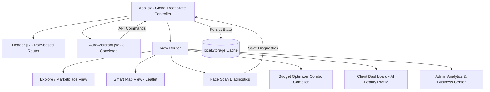

# System Architecture – Aura Beauty OS

This document details the high-level architecture, module decomposition, data persistence schemas, and graphics pipelines driving **Aura Beauty OS**.

---

## 🗺️ Component Diagram & Module Layout

The application separates core layers to ensure high modularity, high performance, and visual isolation:



---

## 💾 Data Persistence Schema (Local Storage Mock DB)

Aura uses two client-side database keys to store profile details, diagnostics metrics, and styling choices persistent across browser reloads:

### 1. Active Session Cache (`AURA_CURRENT_USER`)
Stores the actively logged-in user credentials and active diagnostics:

```json
{
  "name": "Rohan Deshmukh",
  "email": "user@aura.io",
  "role": "user",
  "preferences": ["hair", "facial"],
  "diagnostics": {
    "metrics": {
      "faceShape": "Oval",
      "hairline": "Receding Taper (Normal)",
      "beardDensity": "Medium / Trimmed stubble",
      "mustacheGrowth": "Thick Chevron style",
      "hairTexture": "Wavy & Textured",
      "hairDensity": "High density",
      "forehead": "Balanced proportions",
      "jawline": "Strong angle",
      "skinTone": "Wheatish / Olive",
      "acne": "None (Clean)",
      "pigmentation": "Minimal (Sun spots only)",
      "darkCircles": "Slight (Fatigue based)"
    },
    "recommendations": {
      "bestHairstyle": "Textured Crop / Side Swept Pompadour",
      "avoidHairstyle": "Middle parted shags",
      "bestBeard": "Short Boxed Beard / Stubble",
      "bestMustache": "Chevron Trimmed",
      "hairColor": "Warm Gold highlights",
      "fade": "Mid-skin drop fade",
      "skincare": "Salicylic acid cleanser + Vitamin C serum",
      "facialText": "Brightening Medifacial at Bodycraft Salon",
      "haircutText": "Precision Haircut at Bodycraft Salon"
    }
  }
}
```

### 2. User Accounts Ledger (`AURA_USERS_DB`)
An array containing all registered profiles. On application startup, it seeds standard administrator and customer accounts if empty.

```json
[
  {
    "name": "System Administrator",
    "email": "admin@aura.io",
    "password": "admin123",
    "role": "admin",
    "preferences": ["hair", "facial", "spa", "makeup"],
    "diagnostics": null
  },
  {
    "name": "Rohan Deshmukh",
    "email": "user@aura.io",
    "password": "user123",
    "role": "user",
    "preferences": ["hair", "facial"],
    "diagnostics": { ... }
  }
]
```

---

## 🎨 Graphics & WebGL Render Pipeline

### 3D Holographic Cyber-Face
The 3D floating assistant in `AuraAssistant.jsx` runs a custom **Three.js Canvas** render loop optimized for low CPU/GPU footprints:

1. **Geometry**: A customized `SphereGeometry` represents the base coordinates of the skull face mesh.
2. **Material**: A translucent wireframe `MeshBasicMaterial` colored with luxury gold (`#D5C4A1`) and glowing neon cyan overlays.
3. **Animations Loop**:
   - **Idle (Breathing)**: Periodically adjusts the vertex normals or sphere scales using a standard `Math.sin(time)` modulation.
   - **Listening (Wave)**: A sine wave ripples vertically down the vertex rows, mimicking sound pressure input.
   - **Thinking (Noise)**: Shuffles vertex offsets using pseudo-random Simplex Noise generators.
   - **Speaking (Mouth Scaling)**: Coordinates with audio playback rates, expanding and contracting the lower jaw vertex groups.
4. **Performance Safety**: The Three.js canvas auto-unmounts on drawer close, completely stopping requestAnimationFrame hooks to conserve battery and GPU clock rates.

---

## 🗺️ Leaflet GIS Overlay Architecture
The interactive map (`LocationMap.jsx`) loads tiles asynchronously from OpenStreetMap. 
- Map container coordinates sync dynamically with the client city selector.
- Customized marker anchors calculate routing metrics (Distance in km, driving ETAs, and queue length factors) using deterministic equations, avoiding heavy paid Google Maps API dependencies.
